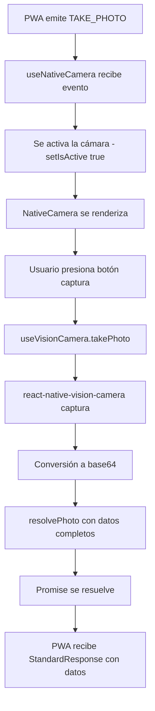

# 📷 Camera Flow Documentation

## Overview

Este documento describe el flujo completo de la funcionalidad de cámara implementada en la aplicación React Native. La funcionalidad permite a la PWA solicitar la captura de fotos y recibir directamente los datos en formato base64 junto con las dimensiones de la imagen.

## 🎯 Objetivo del Flujo

**Flujo simplificado y directo:**

```
PWA emite TAKE_PHOTO → React Native activa cámara → Usuario toma foto → PWA recibe base64 + dimensiones
```

**Patrón utilizado:** Promise-based con async/await para un flujo limpio y manejo de errores robusto.

## 🏗️ Arquitectura del Sistema

### Componentes Principales

1. **NativeCameraProvider** - Context provider para estado global de cámara
2. **useNativeCamera** - Hook principal que maneja eventos EventBus
3. **useVisionCamera** - Hook específico para react-native-vision-camera
4. **NativeCamera** - Componente UI de la cámara

### Flujo de Datos



## 📁 Estructura de Archivos

```
src/event_bus/
├── providers/
│   └── native_camera_provider.tsx      # Context provider
├── hooks/
│   └── use_native_camera.ts           # Hook principal EventBus
├── components/native_camera/
│   ├── index.tsx                      # Componente UI
│   ├── use_vision_camera.ts           # Hook específico cámara
│   └── styles.ts                      # Estilos del componente
└── types/
    └── camera-types.ts                # Tipos TypeScript
```

## 🔄 Flujo Detallado

### 1. Inicialización y Estado

**NativeCameraProvider**

```tsx
// Maneja el estado global de la cámara
const [isActive, setIsActive] = useState<boolean>(false);
const [pendingPhotoPromise, setPendingPhotoPromise] = useState<{
  resolve: (value: TakePhotoDirectResponse) => void;
  reject: (error: Error) => void;
} | null>(null);
```

### 2. Evento PWA → React Native

**PWA envía evento:**

```javascript
const response = await eventBus.emit('TAKE_PHOTO', {
  quality: 0.8,
  maxWidth: 1920,
  maxHeight: 1080,
  cameraType: 'back',
});
```

**React Native recibe en useNativeCamera:**

```typescript
const unsubscribeTakePhoto = eventBus.subscribe(
  EventTypes.TAKE_PHOTO,
  async (payload: TakePhotoRequest) => {
    return await executeTakePhotoDirectly(payload, cameraContext);
  },
);
```

### 3. Activación de Cámara

**executeTakePhotoDirectly:**

```typescript
return new Promise((resolve, reject) => {
  // Configurar Promise pendiente
  cameraContext.setPendingPhotoPromise({ resolve, reject });

  // Activar UI de cámara
  cameraContext.setIsActive(true);
});
```

### 4. Renderizado Condicional

**HomeScreen renderiza cámara:**

```tsx
return (
  <SafeAreaView style={styles.container}>
    {isActiveCam && <NativeCamera />}
    <NativeWebView ref={webViewRef} url={url} hide={isActiveCam} />
  </SafeAreaView>
);
```

### 5. Captura de Foto

**Usuario presiona botón → useVisionCamera.takePhoto:**

```typescript
const takePhoto = async () => {
  // Capturar usando react-native-vision-camera
  const photo = await camera.current.takePhoto({ flash: 'off' });

  // Convertir a base64
  const base64String = await RNFS.readFile(photo.path, 'base64');

  // Crear respuesta
  const photoData: TakePhotoDirectResponse = {
    base64: `data:image/jpeg;base64,${base64String}`,
    width: photo.width,
    height: photo.height,
    success: true,
    timestamp: Date.now(),
  };

  // Resolver Promise → envía respuesta a PWA
  resolvePhoto(photoData);
};
```

### 6. Respuesta a PWA

**Formato de respuesta (StandardResponse):**

```typescript
{
  success: true,
  eventType: "TAKE_PHOTO",
  data: {
    base64: "data:image/jpeg;base64,/9j/4AAQ...",
    width: 1280,
    height: 960,
    success: true,
    timestamp: 1757362539983
  },
  timestamp: 1757362539983
}
```

## 🎛️ Context Provider - Estado Compartido

### NativeCameraProvider

Maneja el estado global de la cámara entre componentes:

```typescript
interface NativeCameraContextProps {
  isActive: boolean;                    // Si la cámara está activa
  setIsActive: (active: boolean) => void;
  pendingPhotoPromise: Promise | null;  // Promise pendiente de resolución
  setPendingPhotoPromise: (...) => void;
  resolvePhoto: (data) => void;         // Helper para resolver Promise
  rejectPhoto: (error) => void;         // Helper para rechazar Promise
}
```

**Funciones helper:**

- `resolvePhoto()`: Resuelve la Promise y limpia estado
- `rejectPhoto()`: Rechaza la Promise y limpia estado
- Ambas automáticamente hacen `setIsActive(false)` al terminar

## 🎨 Componente UI - NativeCamera

### Renderizado Condicional

- Solo se renderiza cuando `isActive === true`
- Ocupa toda la pantalla con `StyleSheet.absoluteFillObject`
- WebView se oculta automáticamente cuando cámara está activa

### Botones de Interacción

- **Botón Captura**: Círculo central para tomar foto
- **Botón Atrás**: Esquina superior izquierda para cancelar

### z-index Management

```tsx
// Asegurar que botones estén por encima de la cámara
<TouchableOpacity
  style={[styles.backButton, { zIndex: 1000 }]}
  onPress={goBack}
>
```

## 🔧 Manejo de Errores

### Tipos de Errores Manejados

1. **Cámara ya activa**

   ```typescript
   if (cameraContext.isActive) {
     return createErrorFromException(
       EventTypes.TAKE_PHOTO,
       new Error('Camera is already active'),
       ErrorCode.CAMERA_NOT_AVAILABLE,
     );
   }
   ```

2. **Sin referencia de cámara**

   ```typescript
   if (!camera.current) {
     const error = new Error('Camera reference not available');
     rejectPhoto(error);
     return;
   }
   ```

3. **Cancelación por usuario**

   ```typescript
   const goBack = () => {
     rejectPhoto(new Error('User cancelled photo capture'));
   };
   ```

4. **Errores de captura**
   ```typescript
   catch (error) {
     Alert.alert('Error', 'No se pudo tomar la foto');
     rejectPhoto(error as Error);
   }
   ```

## 📋 Tipos TypeScript

### Interfaces Principales

```typescript
// Request desde PWA
interface TakePhotoRequest {
  quality?: number;
  maxWidth?: number;
  maxHeight?: number;
  allowEditing?: boolean;
  cameraType?: 'front' | 'back';
}

// Response directa con foto
interface TakePhotoDirectResponse extends CameraPhotoBase64Data {
  success: boolean;
  timestamp: number;
}

// Datos base de foto
interface CameraPhotoBase64Data {
  base64: string;
  width: number;
  height: number;
}
```

## 🚀 Ventajas del Diseño

### 1. **Flujo Directo**

- Un solo evento `TAKE_PHOTO` maneja todo el proceso
- Eliminados eventos internos complejos (`CAMERA_PHOTO_BASE64_PROCESS`, etc.)

### 2. **Promise-Based**

- Patrón moderno y limpio
- Manejo de errores robusto con try/catch
- Timeouts automáticos del EventBus

### 3. **Estado Centralizado**

- Context provider maneja estado compartido
- Limpieza automática al completar/cancelar

### 4. **UI Responsiva**

- Renderizado condicional eficiente
- WebView se oculta durante captura
- z-index management para interacción correcta

### 5. **Tipos Seguros**

- TypeScript end-to-end
- Interfaces claras para request/response
- Validación en tiempo de compilación

## 🔄 Compatibilidad hacia Atrás

El sistema mantiene compatibilidad con eventos antiguos:

```typescript
// MANTENER: Suscripción para compatibilidad hacia atrás
const unsubscribeProcess = eventBus.subscribe(
  EventTypes.CAMERA_PHOTO_BASE64_PROCESS,
  executeCameraPhotoBase64Process,
);
```

Esto permite migración gradual de código existente.

## 🧪 Testing y Debug

### Logs de Debug

- `useVisionCamera`: Logs de captura y procesamiento
- `useNativeCamera`: Logs de eventos EventBus
- `NativeCamera`: Logs de renderizado y disponibilidad de funciones

### Verificación de Estado

```typescript
console.log('📷 NativeCamera render - Functions available:', {
  takePhoto: typeof takePhoto,
  goBack: typeof goBack,
  hasPermission,
  device: !!device,
});
```

## 🔐 Permisos y Dependencias

### Permisos Requeridos

- Camera permission (manejado por react-native-vision-camera)
- Storage permission para archivos temporales

### Dependencias

- `react-native-vision-camera`: Captura de fotos
- `@dr.pogodin/react-native-fs`: Lectura de archivos como base64

## 📱 Ejemplo de Uso en PWA

```javascript
// Función simplificada en PWA
async function takePhoto() {
  try {
    const response = await eventBus.emit('TAKE_PHOTO', {
      quality: 0.8,
      maxWidth: 1920,
      maxHeight: 1080,
      cameraType: 'back',
    });

    if (response.success) {
      const photoData = response.data;
      console.log('Base64:', photoData.base64);
      console.log('Dimensions:', photoData.width, 'x', photoData.height);

      // Usar la foto: mostrar, subir al servidor, etc.
      showPhotoPreview(photoData.base64);
    }
  } catch (error) {
    console.error('Error capturing photo:', error);
  }
}
```

---

**Fecha de última actualización:** Septiembre 2025  
**Versión:** 1.0.0  
**Autor:** Sistema EventBus React Native
